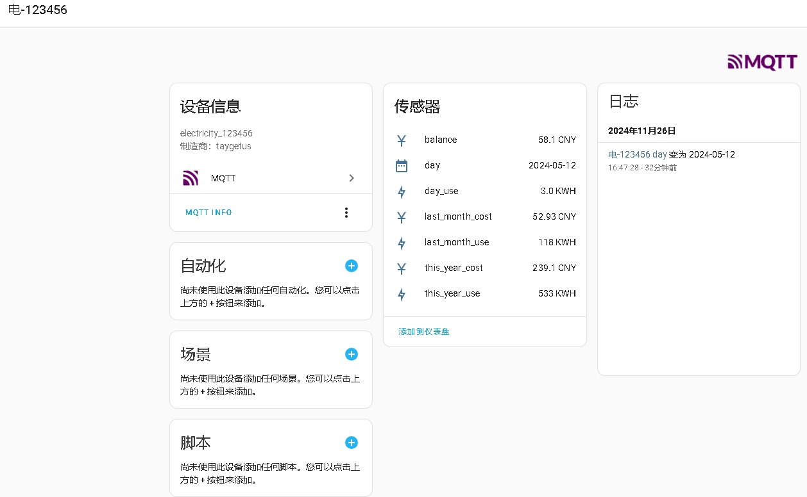

# ⚡️国家电网电力获取

> Fork自 [ARC-MX/sgcc_electricity_new](https://github.com/ARC-MX/sgcc_electricity_new)

# 变化点：
1. 舍弃docker-componse，使用docker run(本人习惯)。
2. 取消http-api向HomeAssistant发送数据，使用mqtt自动发现，实现电费设备。
3. 删除电费余额通知模块。

## 传感器实体
| 实体标识符                   | 说明       | 单位 |
| -------------------------- | ----------| ---- |
| sensor.balance_户号         | 账户余额   | CNY  |
| sensor.day_户号             | 日期       |      |
| sensor.day_use_户号         | 当月用电量 | KWH  |
| sensor.last_month_cost_户号 | 上月费用   | CNY  |
| sensor.last_month_use_户号  | 上月用电量 | KWH  |
| sensor.this_year_cost_户号  | 本年费用   | CNY  |
| sensor.this_year_use_户号   | 本年用电量 | KWH  |

## HomeAssistant生成的设备




## 创建环境变量文件

```bash
cp example.env .env
vim .env
```

## 参考以下文件编写.env文件

```bash
### 以下项都需要修改
## 国网登录信息
# 修改为自己的登录账号
PHONE_NUMBER="xxx" 
# 修改为自己的登录密码
PASSWORD="xxxx" 

# SQLite 数据库配置
# or False 不启用数据库储存每日用电量数据。
ENABLE_DATABASE_STORAGE=True
# 数据库名，默认为homeassistant
DB_NAME="homeassistant.db"
# COLLECTION_NAME默认为electricity_daily_usage_{国网用户id}，不支持修改。

# MQTT 配置（tcp）
MQTT_HOST="127.0.0.1"
MQTT_PORT=1883
MQTT_USER="xxxx"
MQTT_PASS="xxxx"

## selenium运行参数
# 任务开始时间，24小时制，例如"07:00"则为每天早上7点执行，第一次启动程序如果时间晚于早上7点则会立即执行一次，每隔12小时执行一次。
JOB_START_TIME="07:00"

## 其他默认参数
# 浏览器默认等待时间，秒。
DRIVER_IMPLICITY_WAIT_TIME=60
# 登录重试次数
RETRY_TIMES_LIMIT=5
# 登录超时时间，秒
LOGIN_EXPECTED_TIME=60
RETRY_WAIT_TIME_OFFSET_UNIT=10


## 日志级别
# 例如“DUBUG”可以查看出错情况
LOG_LEVEL="INFO"

## 记录的天数, 仅支持填写 7 或 30
# 国网原本可以记录 30 天,现在不开通智能缴费只能查询 7 天造成错误
DATA_RETENTION_DAYS=7
```

## 运行
```shell
docker run -d --restart=unless-stopped \
--name=sgcc_electricity \
-v xxxx/.env:/app/.env \
-v xxxx/homeassistant.db:/app/homeassistant.db \
-e TZ=Asia/Shanghai \
taygetus/sgcc_electricity_mqtt_discoverable
```
> -v xxxx/.env   配置文件</br>
> -v xxxx/homeassistant.db    数据库
